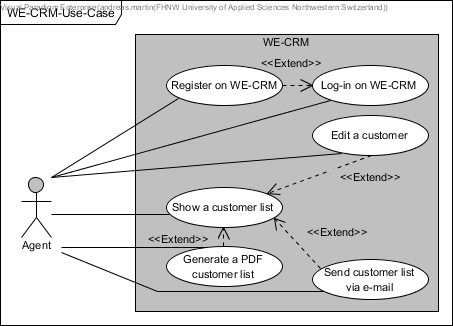
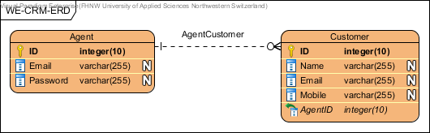
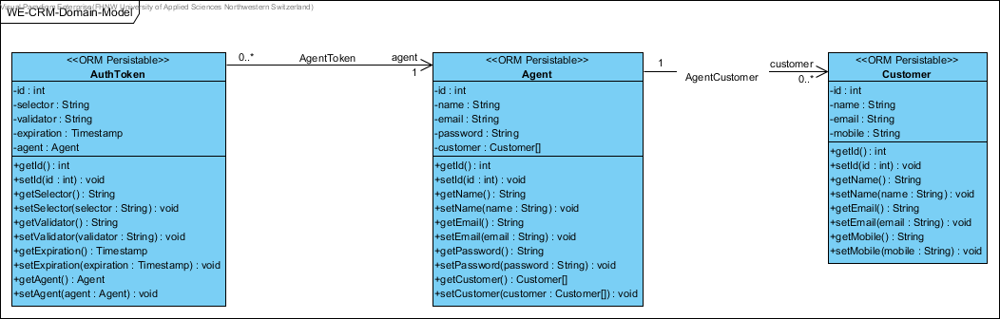
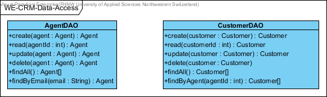
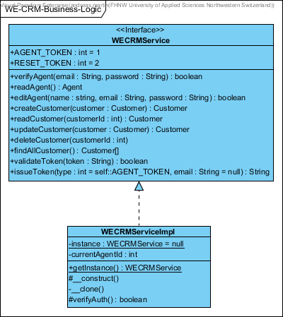
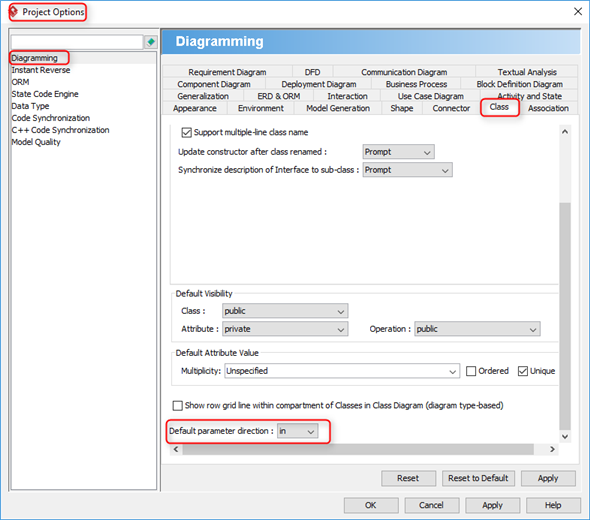
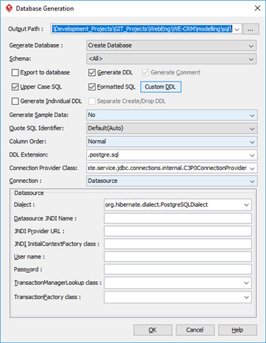

# WE-CRM

## Summary
This is a reference project elaborated by the students step-by-step in every FHNW web engineering lecture.

## Analysis

### Scenario
WE-CRM (Web Engineering Customer-Relationship-Management) is the smallest possible and lightweight demonstration tool that allows agents to manage their customer data. Agents have an own access to their customer data. Besides, agents can email themselves an complete extract or create a PDF of their customers.

### Use Case



- UC-1 [Login on WE-CRM]: Agents can log-in by entering an email address and password. As an extension, new agents my register first.
- UC-2 [Register on WE-CRM]: Agents can register to get an account (profile) to access the WE-CRM system.
- UC-3 [Edit a customer]: Agents can create, update and delete customers.
- UC-4 [Show a customer list]: Agents can get an overview over their customers based on a customer list. As an extension they can create, update and delete customers (UC-3), generate a PDF (UC-5) or send an email (UC-6).
- UC-5 [Generate a PDF customer list]: Agents can generate a PDF containing a list of their customers.
- UC-6 [Send customer list via email]: Agents can send an email containing a list of their customers to their own inbox.

### Constraints

TODO: write

## Design

### Solution Strategy

TODO: write

### Wireframe


### Entity Relationship Diagram



### Domain Model



### Data Access Model



### Business Logic Model



## Implementation

### Stage 1: Building a Static Website with Bootstrap

In stage 01 a bootstrap based prototype has been created by using a prototyping application. 

In this case, the prototype application Bootstrap Studio has been used to create a basic user interface design based on an HTML grid, Bootstrap CSS and JavaScript, including the selection of web fonts and font-based icons.

The assets (HTML, CSS, JavaScript, image and font files) has been exported and will be extended in the later stages by PHP logic, and later with jQuery, to build a dynamic website.

### Stage 2: PHP Files, Basic Router and Session

In stage 02 the HTML prototype files will be transferred to PHP files, and a basic router functionality will be implemented.

#### .htaccess

The following .htaccess configuration ensures that HTTPS is used (except on localhost) and redirects everything (except asset requests) to the index.php file:

```apacheconf
# .htaccess files provide a way to make configuration changes on a per-directory basis
RewriteEngine On

# this ensures that HTTPS is used except on localhost
RewriteCond %{HTTP_HOST} !=localhost
RewriteCond %{HTTPS} off
RewriteCond %{HTTP:X-Forwarded-Proto} !https
RewriteRule ^ https://%{HTTP_HOST}%{REQUEST_URI} [QSA,L,R=301]

# this sends the authorization header to a PHP envirnoment variable
RewriteRule .* - [E=HTTP_AUTHORIZATION:%{HTTP:Authorization}]

# this redirects everything except asset requests to the index.php file
RewriteRule ^(?!.*assets/)(.*) index.php [QSA,L,E=ORIGINAL_PATH:/$1]
RewriteRule assets/(.*) view/assets/$1 [QSA,L]
```

#### Procedural Router

The basic procedural router provides redirection, an error header, the PATH_INFO and a ROOT_URL global. Then, the link structure has been adapted according to the routers (router configuration) using the ROOT_URL global if required.

The following `route_auth` function stores a route (the configured path) in a multidimensional array using the HTTP method and the path. The route consists of an authentication and a route callback function.
```PHP
function route_auth($method, $path, $authFunction, $routeFunction) {
    global $routes;
    $path = trim($path, '/');
    $routes[$method][$path] = array("authFunction" => $authFunction, "routeFunction" => $routeFunction);
}
```
The following `call_route` function is used to process every request. Remember this is a basic procedural router, later it will be transferred to OOP style.
```PHP
function call_route($method, $path) {
    global $routes;
    global $errorFunction;
    $path = trim(parse_url($path, PHP_URL_PATH), '/');
    if(!array_key_exists($method, $routes) || !array_key_exists($path, $routes[$method])) {
        $errorFunction(); return;
    }
    $route = $routes[$method][$path];
    if(isset($route["authFunction"])) {
        if (!$route["authFunction"]()) {
            return;
        }
    }
    $route["routeFunction"]();
}
```
#### Session

Sessions are an almost secure (not 100%) way to identify a user over several requests.

It is recommended to start a session at the beginning of a PHP script as follows: 
```PHP
session_start();
```

Then a session value (such as a user id) can be stored in the session array:
```PHP
$_SESSION["key"] = "value";
```

And a value can be accessed again:
```PHP
$value = $_SESSION["key"];
```

Finally, a session can be destroyed again if required (such as logout):
```PHP
session_destroy();
```

### Stage 3: Database, .env Config Files and Passwords

In stage 3 (and stage 4) WE-CRM will be extended with a database functionality. 

As a first step, an [Entity Relationship Diagram](#entity-relationship-diagram) needs to be created, which can be partially be derived from the use case's nouns.

Depending on the modelling environment, a [Domain Model](#domain-model) can be created in-sync at the same time. Please make sure that ["in" parameter direction](#default-parameter-direction-configuration) is configured. The [Domain Model](#domain-model) will be used in stage 7 to implement a basic object-relational mapping (ORM) using PDO.

As a result and depending on the modelling environment ([Visual Paradigm Postgresql Database Generation](#postgresql-database-generation)), a Data Definition Language (DDL) SQL can be exported as follows:

```SQL
CREATE TABLE Customer (
  ID      SERIAL NOT NULL, 
  Name    varchar(255) NOT NULL, 
  Email   varchar(255) NOT NULL, 
  Mobile  varchar(255) NOT NULL, 
  AgentID int4 NOT NULL, 
  PRIMARY KEY (ID));
CREATE TABLE Agent (
  ID       SERIAL NOT NULL, 
  Name     varchar(255) NOT NULL, 
  Email    varchar(255) NOT NULL, 
  Password varchar(255) NOT NULL, 
  PRIMARY KEY (ID));
CREATE TABLE AuthToken (
  ID         SERIAL NOT NULL, 
  AgentID    int4 NOT NULL, 
  Selector   varchar(255) NOT NULL, 
  Validator  varchar(255) NOT NULL, 
  Expiration timestamp NOT NULL, 
  Type       int4 NOT NULL, 
  PRIMARY KEY (ID));
ALTER TABLE Customer ADD CONSTRAINT AgentCustomer FOREIGN KEY (AgentID) REFERENCES Agent (ID);
ALTER TABLE AuthToken ADD CONSTRAINT AgentToken FOREIGN KEY (AgentID) REFERENCES Agent (ID);
```

As a result of this stage, the user (agent) registration and login will be realized using ([Sessions](#session)), ([.env Config Files](#env-config-files)), ([PDO](#pdo)) and dealing with ([Passwords](#session)) securely.

#### .env Config Files

As a best practice, database related configuration should be stored outside of the source code in a configuration file. By convention, `.env` files must be kept outside of a version control by adding an entry to `.gitignore`. In this web application, the database configuration will be loaded from an INI file with an `.env` extension, since PHP provides already integrated functions for reading INI files. The file in the `config` folder may look like this:

```ini
[database]
driver=<driver>
host=<host>
database=<database>
user=<user>
port=5432
password=<password>
``` 

To read such an INI file, the following PHP functions can be used:
```PHP
$iniFile = "config/config.env";
if(file_exists($iniFile)) {
    $dataArray = parse_ini_file($iniFile, true);
    $dataConfigArray = $dataArray[database];
    // ...
}
```

If this application is deployed out of this GitHub repository to Heroku, the Heroku app can be extended with a Postgresql database. The configuration items to this database can be accessed from PHP code, which is running on Heroku, by using environment variables as follows:
```PHP
if(isset($_ENV["DATABASE_URL"])){
    $dbopts = parse_url(getenv('DATABASE_URL'));
    $config["pdo"]["dsn"] = "pgsql" . ":host=" . $dbopts["host"] . ";port=" . $dbopts["port"] . "; dbname=" . ltrim($dbopts["path"],'/') . "; sslmode=require";
    $config["pdo"]["user"] = $dbopts["user"];
    $config["pdo"]["password"] = $dbopts["pass"];
}
```

#### PDO

As a next step, the user (agent) registration and login are realized using PDO for data access.

In order to use PDO with Postgresql the following lines need to be un-commented in php.ini:
```INI
extension=php_pdo_pgsql.dll
extension=php_pgsql.dll
```

As a good practice, the PDO instantiation should be kept in a different file (in a later stage different class containing static methods).

The initialization of PDO can be realized as following:
```PHP
$pdoInstance = new PDO ($dsn, $username, $password);
$pdoInstance->setAttribute(PDO::ATTR_ERRMODE, PDO::ERRMODE_EXCEPTION);
```

Then prepared statements can be executed. In the following example an associative array (`PDO::FETCH_ASSOC`) will be returned. In the later stage 7, objects will be mapped to tables (`PDO::FETCH_CLASS`):
```PHP
$stmt = $pdoInstance->prepare('SELECT * FROM table WHERE id = :id;');
$stmt->bindValue(':id', $id);
$stmt->execute();
$resultArray = $stmt->fetchAll(PDO::FETCH_ASSOC);
```

### Passwords

Passwords are extremely sensitive data.
1. They must be transmitted over HTTPS only - never HTTP only!
2. Always the best hashing method available in PHP must be used before storing a password in a database table.
3. Try to keep the raw / un-hashed password as short as possible in memory.

A secure password hashing in PHP can be realized as follows:
```PHP
$hashedPassword = password_hash($_POST["password"], PASSWORD_DEFAULT);
// store the $hashedPassword in DB
```

A secure password verification with a re-hashing if required can be realized as follows:
```PHP
if (password_verify($_POST["password"], $hashedPassword)) {
    // start session
    if (password_needs_rehash($hashedPassword, PASSWORD_DEFAULT)) {
        $reHashedPassword = password_hash($_POST["password"], PASSWORD_DEFAULT);
        // store the $reHashedPassword in DB
    }
}
```

### Stage 4: Dynamic Views

In stage 4, the web-application is extended with functionality to store and retrieve customer data in a procedural way and similar as described in the ([PDO](#pdo)) section.

The view files are extended with `<?php ?>` tags injecting the required dynamic data. In this stage, it is still a procedural implementation. The following example shows how a HTML table can be dynamically populated:
```PHP
<?php foreach($customers as $customer): ?>
    <tr>
        <td><?php echo $customer["id"] ?> </td>
        <td><?php echo $customer["name"] ?></td>
        <td><?php echo $customer["email"] ?> </td>
        <td><?php echo $customer["mobile"] ?> </td>
    </tr>
<?php endforeach; ?>
```

The following code snipped shows how an HTML form input field value can be set, if data is available:
```PHP
<input class="form-control" type="email" name="email" value="<?php echo !empty($customer["email"]) ? $customer["email"] : ''; ?>">
```

### Stage 12: Auth and Remember Me

### Stage 13: Email and Password Reset
- SendGrid API

### Stage 14: PDF
- HyPDF API

### Stage 15: REST Service API

### Stage 16: JavaScript & jQuery Client

## Evaluation and Deployment

### Project Set-Up

TODO: write

#### Visual Paradigm
#####  Default Parameter Direction Configuration
Go to `Window -> Project Options`


#####  Postgresql Database Generation


#### Git
The project contains a .gitignore file to keep certain 

### Heroku Deployment

[](https://heroku.com/deploy)

## Maintainer

- [Andreas Martin](https://github.com/andreasmartin)

## License

- [Apache License, Version 2.0](LICENSE)
